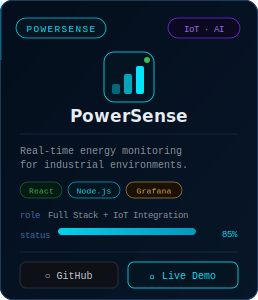
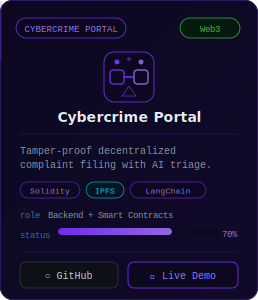
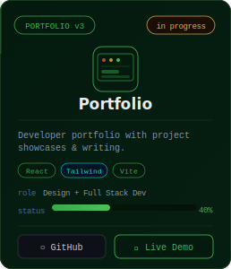

<!--
  ╔══════════════════════════════════════════════════════════════════════════╗
  ║   harish@github — developer control center                               ║
  ║   Powered by AI · Cloud · Industrial IoT                                 ║
  ║   Built for GitHub rendering. No CSS, no JS. Pure SVG + Markdown.        ║
  ╚══════════════════════════════════════════════════════════════════════════╝
-->

 

---

---

| &nbsp; | &nbsp; | &nbsp; |
|:---:|:---:|:---:|
|  |  |  |

---

---

---

---

&nbsp;&nbsp;&nbsp;

---

 

<!--
  ╔══════════════════════════════════════════════════════════╗
  ║  Thanks for exploring. You've reached the end of the     ║
  ║  filesystem. There's nothing more to see here.           ║
  ║                                                          ║
  ║  Or is there?                                            ║
  ╚══════════════════════════════════════════════════════════╝
-->
