<!-- ⚠️ This file is auto-generated. Edit config/profile.json and run `npm run generate` to update. -->
<!--
  Harish Ram S · GitHub Profile
  Config-driven premium developer profile.
  Source of truth: config/profile.json
-->

<!--suppress HtmlUnknownAttribute -->
<code>FEATURED WORK</code>

<code>GITHUB</code>

  

<table border="0" cellspacing="0" cellpadding="0">
<tr>
<td align="center">

</td>
<td align="center">

</td>
</tr>
</table>

 

<!-- Generated by scripts/generate-readme.js at 2026-06-25T08:53:44.570Z -->